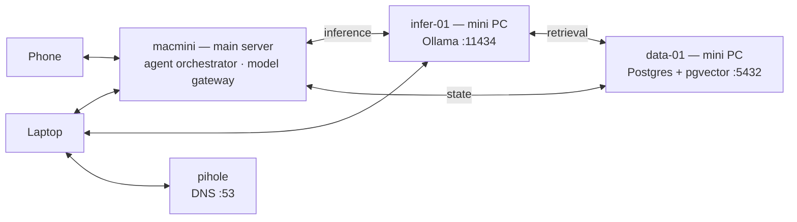
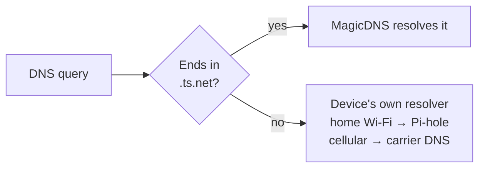

# Applied AI Lab — Tailscale + MagicDNS (Device Plane)

Status: **draft**. Companion to
[TUNNEL-ARCHITECTURE.md](TUNNEL-ARCHITECTURE.md).

Covers device-to-device connectivity: a Mac mini main server, a few mini PC
nodes, and the clients that drive them. Public app publishing runs over
Cloudflare Tunnel and is documented separately — the two planes are independent
by design.

---

## 1. Peer-to-peer, not a VPN concentrator

Every device runs the Tailscale client and signs in to the same account, forming
one **tailnet**. There is no server in the middle:



Inference on one box, the vector store on another, agents orchestrated from the
Mac mini — and a laptop anywhere in the world addressing all of them by name as
if they were on the same desk.

**Not on this plane:** Home Assistant, Samba, and Nextcloud belong to the
Raspberry Pi homelab, a separate project that shares the tailnet. The AI lab
nodes above are their own machines.

| | Traditional VPN | Tailscale |
|---|---|---|
| Path | every device → one server → destination | device → destination, directly |
| Bottleneck | the concentrator | none |
| If the middle dies | everything stops | already-established links keep working |
| Your traffic | transits the server | never transits Tailscale |

A coordination server hands out keys and publishes names, then steps aside.
Devices NAT-punch through both routers and connect directly, encrypted end to
end. Nothing is port-forwarded and the home IP is never exposed.

---

## 2. MagicDNS fundamentals

Every node gets a stable `100.x.y.z` tailnet address on join. Memorable it is
not. MagicDNS is the tailnet's own DNS server holding a live record per node:

```
macmini.your-tailnet.ts.net   →  100.x.y.z
infer-01.your-tailnet.ts.net  →  100.x.y.z
data-01.your-tailnet.ts.net   →  100.x.y.z
pihole.your-tailnet.ts.net    →  100.x.y.z
```

- Records update themselves when an address changes — nothing to maintain.
- Names resolve from any tailnet device, on any network, anywhere.
- Resolution is tailnet-internal; these names do not exist on public DNS.

### 2.1 The nameserver entry is Pi-hole's *Tailscale* IP

Past `.ts.net` names, MagicDNS forwards other queries to a nameserver you
choose. That field holds Pi-hole's address, and which address matters:

| Value | Result |
|---|---|
| `100.x.y.z` — Pi-hole's tailnet address | Reachable from any tailnet device on any network |
| `192.168.x.x` — Pi-hole's LAN address | Unreachable once you leave the house; DNS silently dies on cellular |

This is the reason the Pi Zero joins the tailnet at all. Pi-hole stays LAN-scoped
for home Wi-Fi via router DHCP; its tailnet address exists so the admin UI is
reachable remotely and so this nameserver entry resolves from anywhere.

### 2.2 Override local DNS is OFF

One toggle decides the scope of all of the above, and it is what keeps the two
planes from interfering:



Disabled, MagicDNS answers for tailnet names and everything else falls through
to the device's normal resolver. All intended:

- Phones on cellular are **not** forced through Pi-hole — no broken captive portals.
- `*.datasharkvag.com` resolves through public DNS exactly as it does for any visitor.

Enabling it would make Pi-hole the global nameserver for every device anywhere,
which this homelab explicitly rejected.

---

## 3. Applied AI lab — what runs where

A Mac mini as the main server plus a few mini PCs, each doing one job. MagicDNS
names are stable, so config files and notebooks hardcode a name once and keep
working when a box moves network or changes address.

| Node | Runs | Reached at |
|---|---|---|
| `macmini` | Main server — agent orchestrator, model gateway | `macmini.tailnet.ts.net` |
| `infer-01` | Ollama — local inference | `http://infer-01.tailnet.ts.net:11434` |
| `data-01` | Postgres + pgvector — embeddings, agent state | `data-01.tailnet.ts.net:5432` |
| `pihole` | DNS + admin UI | `pihole.tailnet.ts.net` |
| any node | Admin shell | `tailscale ssh user@node` |

An agent on the Mac mini calls `infer-01…:11434` for generation and
`data-01…:5432` for retrieval and run state. The laptop drives or debugs it
using the same two names — at home, on cellular, or on a coffee-shop network.

Scaling out is adding a node, not re-architecting: a second mini PC for a larger
model joins as `infer-02` and every client addresses it by name immediately.

### 3.1 Bind to the tailnet address, never `0.0.0.0`

Ollama and Postgres both ship with **no authentication**. Here the network *is*
the access control, which only holds if the services listen on the Tailscale
interface alone. Bound to `0.0.0.0`, an open model endpoint and an
unauthenticated database are exposed to every machine on whatever LAN the box
sits on — a café, a conference network, a friend's house.

```ini
# Ollama — systemd drop-in
Environment="OLLAMA_HOST=100.x.y.z:11434"

# Postgres — postgresql.conf
listen_addresses = '100.x.y.z'
```

Verify from a machine off the tailnet: both ports must refuse the connection.

### 3.2 Tightening it further

- **ACL tags** — tag nodes `tag:ai-server` / `tag:client` and grant only what each
  needs. Default policy lets every device reach every node; a compromised phone
  should not be able to open the database.
- **Tailscale SSH** — hands key management to the tailnet. No `authorized_keys`
  to distribute, and access follows the same ACL as everything else.
- **`tailscale serve`** — real HTTPS on a `.ts.net` name without touching NPM.
  Useful for a Jupyter or Open WebUI front end that dislikes plain HTTP.
- **Disable key expiry** on headless servers. An expired node goes dark until
  someone re-authenticates it locally — painful on a machine with no monitor.
- **Funnel stays off.** Publishing to the internet is the tunnel plane's job;
  mixing the two is how a lab box ends up publicly reachable by accident.

---

## 4. Setup

1. Install Tailscale on every node — servers, Pis, phone, laptop — same account.
2. Admin console → **DNS** → enable **MagicDNS**.
3. Add Pi-hole's `100.x.y.z` address as the nameserver (§2.1).
4. Leave **Override local DNS** disabled (§2.2).
5. Rename nodes so MagicDNS names are meaningful.
6. Bind Ollama and Postgres to their tailnet addresses (§3.1).

Verify from a device off the home network and off Wi-Fi:

```bash
tailscale status                              # every node listed, direct where possible
ping macmini.your-tailnet.ts.net              # name resolves, peer reachable
curl http://infer-01.your-tailnet.ts.net:11434/api/tags   # inference reachable by name
psql -h data-01.your-tailnet.ts.net -U app    # vector store reachable by name
dig weather.datasharkvag.com                  # still public DNS — override is off
```

The last check is the one people forget. A `100.x` answer means Override local
DNS got switched on and the planes have started to overlap.

Then the negative test, from a machine **not** on the tailnet — both must refuse:

```bash
curl http://<infer-01-lan-ip>:11434   # must fail
nc -vz <data-01-lan-ip> 5432          # must fail
```

---

## 5. Operational notes

- **The device list is an access list.** Without ACL tags (§3.2), any device in
  the tailnet reaches every node. Revoking access means removing the device here
  *and* from the Cloudflare Access allowlist.
- **No exit nodes or subnet routes.** Each node is reachable as itself. Keeping
  it that way is what makes the Override-off story simple.

---

## 6. Open questions

- Define ACL tags now, or accept "all devices reach all nodes" at this size?
- Is `infer-01` CPU inference, or does a mini PC have a GPU worth documenting?
- Does the Mac mini also serve models (MLX / Metal), or is it orchestration only?
- Does the sensor node need the tailnet, or is its InfluxDB write purely LAN-local?
